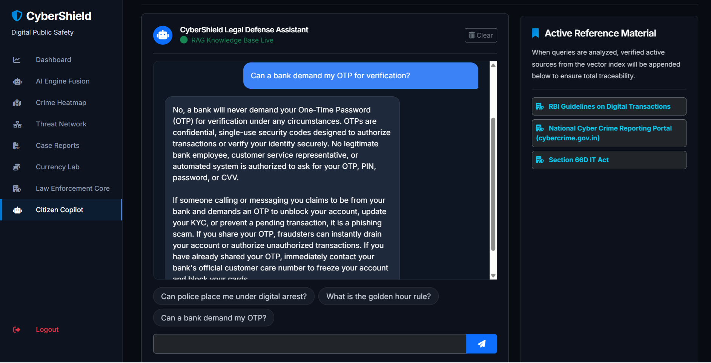
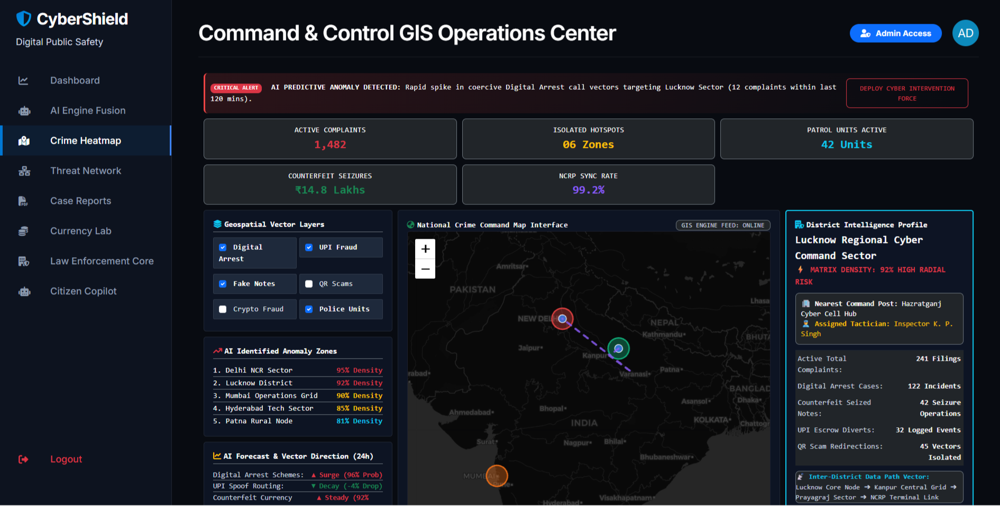
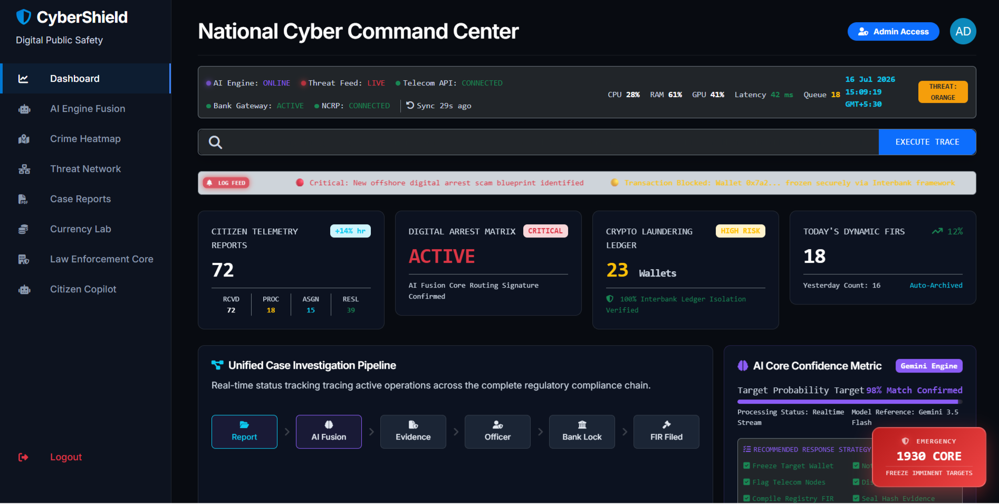
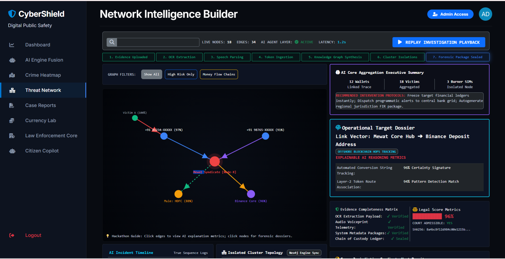

# CyberShield AI

> AI-powered Law Enforcement Intelligence Platform developed for the ET Government Hackathon.


---

# Overview

CyberShield AI is a student-built cybersecurity and law enforcement intelligence platform developed as part of the ET Government Hackathon.

The project combines Artificial Intelligence, Cybersecurity and Data Visualization to help investigators analyze crime-related information using an interactive dashboard.

---

# Features

-  AI Copilot (Gemini API)
-  Crime Heatmap
-  Threat Network Analysis
-  Counterfeit Currency Detection
-  Police Dashboard
-  Cybercrime Intelligence Dashboard
-  Interactive GIS Visualization

---

# 🛠️ Technology Stack

| Technology | Purpose |
|------------|----------|
| Python | Backend |
| Flask | Web Framework |
| SQLite | Database |
| HTML/CSS | Frontend |
| JavaScript | Client-side Logic |
| Leaflet.js | Maps |
| Google Gemini API | AI Assistant |

---

# Screenshots

## Screenshots

### AI Copilot


### Crime Heatmap


### Dashboard


### Threat Network


---

# Installation

```bash
git clone https://github.com/aryanverma-7/CyberShield-AI.git

cd CyberShield-AI

pip install -r requirements.txt

python run.py
```

---

# Environment Variables

Create a `.env` file and add:

```env
GEMINI_API_KEY=YOUR_GEMINI_API_KEY
SECRET_KEY=YOUR_SECRET_KEY
FLASK_ENV=development
```

---

# Project Structure

```
CyberShield-AI
│
├── app/
├── Screenshots/
├── config.py
├── requirements.txt
├── run.py
├── README.md
└── LICENSE
```

---

# Future Improvements

- User Authentication
- Case Management
- AI Report Generation
- Predictive Crime Analytics
- Cloud Deployment

---

# Developer

**Aryan Verma**

B.Tech Student

---

# License

This project is licensed under the MIT License.